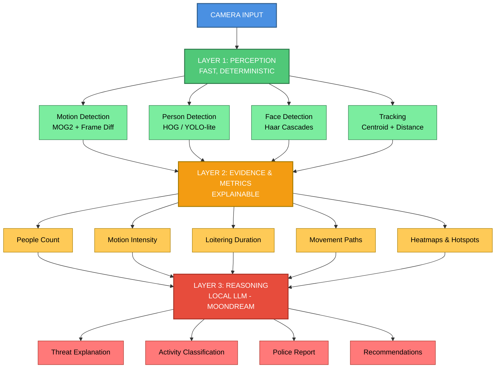
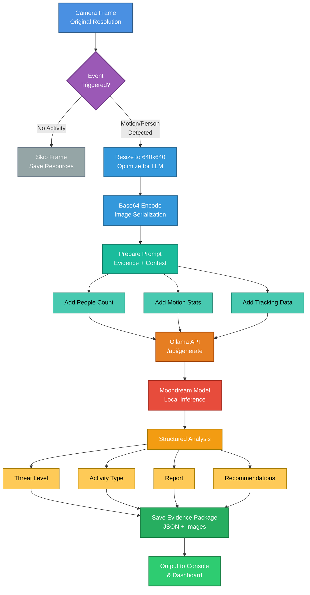

################################################################################
#                                                                              #
#                              MOONDREAM                                       #
#                                                                              #
#              Edge-Optimized AI Surveillance & Reasoning System               #
#                                                                              #
################################################################################

Moondream is a **next-generation AI surveillance assistant** that combines
**classical computer vision** with a **local multimodal LLM** to deliver
**explainable, evidence-driven security analysis** on resource-constrained
edge devices (e.g. 4GB VRAM GPUs).

This project is designed to be **hackathon-ready**, **police-relevant**, and
**ethically grounded**, focusing on transparency, performance, and trust.

--------------------------------------------------------------------------------
## WHY MOONDREAM?
--------------------------------------------------------------------------------

Most surveillance demos either:
- run heavy deep models on every frame (slow, wasteful), or
- rely on black-box AI decisions (hard to trust).

Moondream is different.

It follows a **three-layer hybrid architecture**:

The LLM **never replaces perception** — it only **explains evidence**.

--------------------------------------------------------------------------------
## CORE FEATURES
--------------------------------------------------------------------------------

[✔] Real-time motion detection  
[✔] Person & face detection (no identity recognition)  
[✔] Multi-person tracking & movement statistics  
[✔] Motion heatmaps & hotspot analysis  
[✔] Event-triggered LLM reasoning (local, offline)  
[✔] Structured threat assessment & reports  
[✔] Evidence packages (images + JSON)  
[✔] Optimized for RTX 3050 Mobile (4GB VRAM)  

--------------------------------------------------------------------------------
## LOCAL LLM INTEGRATION
--------------------------------------------------------------------------------

Moondream uses a **local multimodal LLM** via Ollama.

✔ No cloud calls  
✔ No OpenAI / external APIs  
✔ Fully offline  
✔ Privacy-preserving  

--------------------------------------------------------------------------------
## PERFORMANCE PHILOSOPHY
--------------------------------------------------------------------------------

Moondream is **event-driven**, not frame-driven.

- Vision runs continuously (cheap)
- AI runs only when needed (expensive)
- Best frame is selected for analysis
- Heavy models are **selectively triggered**

This makes the system:
- Faster
- More accurate
- More scalable
- Suitable for edge deployment

--------------------------------------------------------------------------------
## OPTIONAL: EVENT-TRIGGERED SEGMENTATION (SAM)
--------------------------------------------------------------------------------

To improve explainability and evidence quality, segmentation can be enabled:

    IF (people_detected > 0 AND threat_level >= SUSPICIOUS):
        → Run SAM on selected frame
        → Extract pixel-accurate regions
        → Store masks as evidence

Benefits:
- Clear visual proof for police
- Strong hackathon differentiator
- No performance waste on normal scenes

--------------------------------------------------------------------------------
## INSTALLATION
--------------------------------------------------------------------------------

1) Clone repository

    git clone https://github.com/obiwankenobi699/moondream.git
    cd moondream

2) Create environment

    python3 -m venv .venv
    source .venv/bin/activate

3) Install dependencies

    pip install -r requirements.txt

4) Install Ollama and pull model

    ollama pull moondream

--------------------------------------------------------------------------------
## RUNNING
--------------------------------------------------------------------------------

    uv run python EyerisAI.py

The system runs in **interactive surveillance sessions** and outputs:

- Real-time logs
- Evidence images
- Heatmaps
- JSON threat reports

--------------------------------------------------------------------------------
## OUTPUT EXAMPLE
--------------------------------------------------------------------------------

{
  "threat_level": "safe",
  "people_detected_max": 2,
  "faces_detected": 1,
  "motion_events": 32,
  "motion_intensity": "low",
  "recommended_action": "Continue routine monitoring",
  "ai_model_used": "moondream"
}

--------------------------------------------------------------------------------
## POLICE & PUBLIC SAFETY VALUE
--------------------------------------------------------------------------------

Moondream is designed to assist — not replace — human judgment.

Key advantages:
- Explainable decisions
- Evidence-based reasoning
- Privacy-aware design
- No biometric identification
- Clear audit trail

Ideal for:
- Smart city surveillance
- Campus security
- Public transport monitoring
- Hackathons & research demos

--------------------------------------------------------------------------------
## ETHICAL & LEGAL NOTES
--------------------------------------------------------------------------------

- No face recognition or identity matching
- No continuous recording
- Event-based capture only
- Human-in-the-loop by design

Always ensure compliance with local surveillance laws.

--------------------------------------------------------------------------------
## ROADMAP
--------------------------------------------------------------------------------

[ ] Multi-camera orchestration  
[ ] Threat score with factor weights  
[ ] Officer-friendly dashboard  
[ ] Evidence hashing & chain-of-custody  
[ ] Real-time alert integrations  

--------------------------------------------------------------------------------
## LICENSE
--------------------------------------------------------------------------------

MIT License

--------------------------------------------------------------------------------

